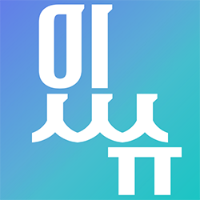

# README

# 📰 책상 앞에서 세상을 알다

**있슈 easssue**는 현대인이 최근 이슈를 쉽게 접할 수 있도록 도움을 주는 정보 제공 익스텐션 프로젝트입니다. 이슈에 대한 접근성을 높이기 위해 크롬 확장 프로그램을 통한 웹 서비스로 기획했습니다. 있슈 프로젝트의 기획 의도는 크롬 확장 프로그램 제작과 자연어 처리 기반의 서비스 개발 경험입니다. 더 좋은 사용자 경험을 위하여 이슈 트래킹 및 뉴스 핵심 요약 서비스를 제공합니다.

**있슈 easssue** : 쉬운 ***easy*** + 이슈 ***issue***, 여기에 모든 이슈가 ***있슈***!

## 💙 Show

### New Tab

### Dashboard

### Pop Up

## 💡 Description

### 프로젝트 기획 배경

- 시시각각 변하고, 그에 따라 많은 뉴스도 생산되는 현대 사회에서 원하는 키워드에 대한 이슈 트래킹을 할 수 있는 서비스 제공
- 뉴스를 통해 전문성있고 빠른 이슈를 습득할 수 있는 기회 제공
- 길고 복잡한 내용의 기사를 핵심 워드 클라우드 및 3줄 요약 기능으로 간편하게 파악할 수 있는 서비스 제공
- 크롬 브라우저의 새 탭 기능과 어떤 url에서도 사용 가능한 팝업 기능을 기반으로 접근성과 사용성 높인 크롬 확장 프로그램 서비스로 제공

### 주요 서비스 기능

- 관심있는 키워드 및 금지 키워드를 통한 사용자 맞춤형 최신 뉴스
- 트렌드 파악을 용이하게 해주는 실시간 검색어
- 읽은 기사를 기반으로 한 맞춤형 키워드 추천
- 사용자가 읽은 기사에 대한 정보를 확인할 수 있는 대쉬보드
- 직접 내용을 구성하고 꾸밀 수 있는 크롬 브라우저 새 탭
- 기사를 바탕으로 구성된 워드 클라우드와 3줄 요약을 실시간으로 제공하는 크롬 팝업

## 🧭 Base

### Mockup

### ERD

# 🏁 Run

- 프로그램 서비스 소개 페이지 ([link](https://www.easssue.com/))
    
    [있슈 easssue](https://www.easssue.com/)
    

- 크롬 확장 프로그램 설치
    1. [chrome 웹 스토어](https://chrome.google.com/webstore/category/extensions) 접속
    2. 있슈 또는 easssue 검색
    3. Chrome에 추가 클릭
    
    
    
    ⬇️ 있슈 easssue 확장 프로그램 Chrome에 추가 바로가기 링크
    
    [있슈 easssue](https://chrome.google.com/webstore/detail/%EC%9E%88%EC%8A%88-easssue/cmnmdjpabceejnbkdlijepkmcdpdohjl)
    

# 🛠️ Dev skills

## Backend

## Frontend

## Data

## Infra

# 🍋 Team. Limemul

### 김효은

---

팀장 Backend

### 엄성현

---

부팀장 Frontend

### 임소연

---

Data

### 지승영

---

Data

### 전효인

---

Backend

### 한유빈

---

Frontend