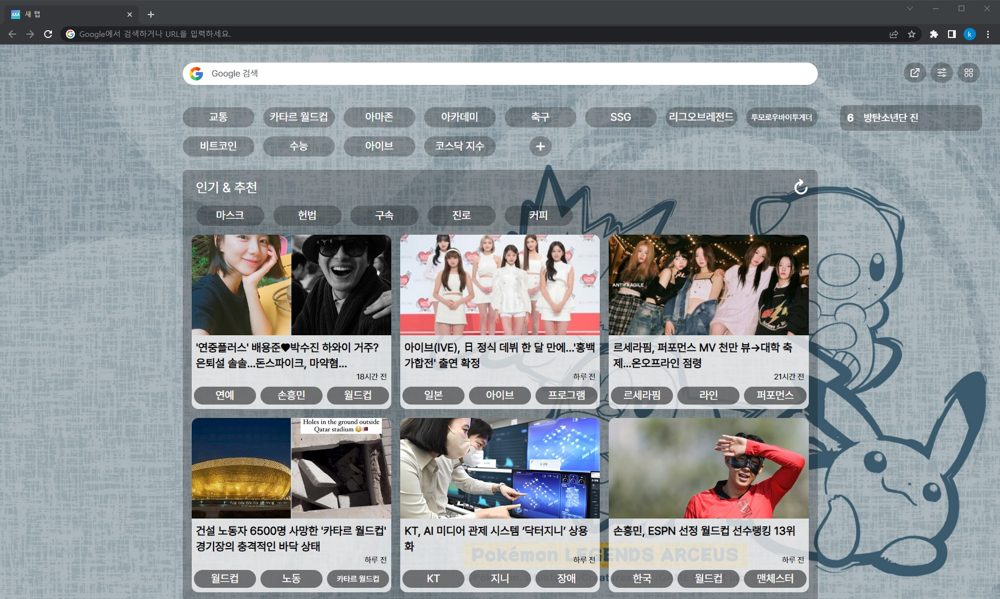

# 📰 책상 앞에서 세상을 알다

**있슈 easssue**는 현대인이 최근 이슈를 쉽게 접할 수 있도록 도움을 주는 정보 제공 익스텐션 프로젝트입니다. 이슈에 대한 접근성을 높이기 위해 크롬 확장 프로그램을 통한 웹 서비스로 기획했습니다. 있슈 프로젝트의 기획 의도는 크롬 확장 프로그램 제작과 자연어 처리 기반의 서비스 개발 경험입니다. 더 좋은 사용자 경험을 위하여 이슈 트래킹 및 뉴스 핵심 요약 서비스를 제공합니다.

**있슈 easssue** : 쉬운 **_easy_** + 이슈 **_issue_**, 여기에 모든 이슈가 **_있슈_**!

---

### 목차

- [📰 책상 앞에서 세상을 알다](#-책상-앞에서-세상을-알다)
    - [목차](#목차)
  - [💡 프로젝트 기획](#-프로젝트-기획)
    - [기획 배경](#기획-배경)
    - [주요 서비스 기능](#주요-서비스-기능)
    - [Mockup](#mockup)
    - [ERD](#erd)
  - [💙 결과물](#-결과물)
    - [New Tab](#new-tab)
    - [ADD Keyword](#add-keyword)
    - [Dashboard](#dashboard)
    - [Pop Up](#pop-up)
  - [🏁실행](#실행)
  - [🛠️ Dev skills](#️-dev-skills)
    - [Backend](#backend)
    - [Frontend](#frontend)
    - [Data](#data)
    - [Infra](#infra)
    - [시스템 아키텍처](#시스템-아키텍처)
  - [🍋 팀 소개](#-팀-소개)
    - [Team. Limemul](#team-limemul)
    - [ Team Notion](#-team-notion)
    - [Teammates](#teammates)

## 💡 프로젝트 기획

### 기획 배경

- 빠르게 변하는 사회에서, 사용자가 **관심 있는 키워드와 실시간 키워드**를 쉽고 빠르게 **이슈 트레킹** 할 수 있는 서비스 제공

- 뉴스를 통해 빠르게, 전문성 있는 이슈를 습득할 수 있는 기회를 제공

- 길고 복잡한 내용의 기사를 3줄 요약하는 기능 제공

- 크롬 새 탭과 팝업을 통해, 접근성과 사용성이 높은 서비스 제공

### 주요 서비스 기능

- 관심 키워드와 금지 키워드에 기반한 맞춤형 뉴스피드
- 트렌드 파악을 용이하게 해주는 실시간 검색어
- 읽은 기사를 기반으로 한 맞춤형 키워드 추천
- 사용자가 읽은 기사에 대한 정보를 확인할 수 있는 대쉬보드
- 크롬 브라우저 새 탭에서 뉴스피드 제공
- 크롬 팝업을 통해 웹사이트 내용의 3줄 요약과 워드클라우드를 실시간 제공

### Mockup

### ERD

## 💙 결과물

### New Tab

### ADD Keyword

### Dashboard

### Pop Up

## 🏁실행

- 프로그램 서비스 소개 페이지 ([link](https://www.easssue.com/))

  [있슈 easssue](https://www.easssue.com/)

- 크롬 확장 프로그램 설치
  1. [chrome 웹 스토어](https://chrome.google.com/webstore/category/extensions) 접속
  2. 있슈 또는 easssue 검색
  3. Chrome에 추가 클릭
  
  ⬇️ 있슈 easssue 확장 프로그램 Chrome에 추가 바로가기 링크
  [있슈 easssue](https://chrome.google.com/webstore/detail/%EC%9E%88%EC%8A%88-easssue/cmnmdjpabceejnbkdlijepkmcdpdohjl)

## 🛠️ Dev skills

### Backend

### Frontend

### Data

### Infra

### 시스템 아키텍처

## 🍋 팀 소개

### Team. Limemul

한잔의 🍋라임물🍋로 시작하는 갓생을 사는 그/그녀들에게 꽂혀버린 팀원들

###  [Team Notion](https://www.notion.so/easssue-093a7d08efb54fb9b61b7fce93cedd85)

### Teammates

|  이름  |                 엄성현                  |              임소연               |                 지승영                  |                      한유빈                      |                전효인                 |                   김효은                    |
| :----: | :-------------------------------------: | :-------------------------------: | :-------------------------------------: | :----------------------------------------------: | :-----------------------------------: | :-----------------------------------------: |
| 포지션 |                   FE                    |               Data                |                  Data                   |                        FE                        |                  BE                   |                  BE, 팀장                   |
| Github | [eomsteve](https://github.com/eomsteve) | [Im-sy](https://github.com/Im-sy) | [jisy2718](https://github.com/jisy2718) | [mintfrog1209](https://github.com/mintfrog-1209) | [zaq1290](https://github.com/zaq1290) | [Chosephine](https://github.com/Chosephine) |
